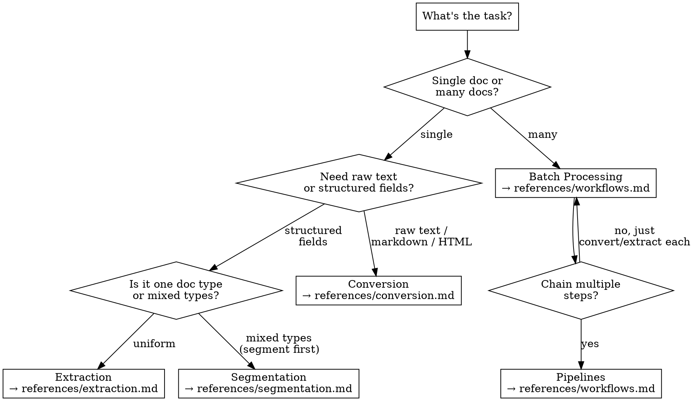

# Chandra OCR — Datalab Document Processing

Process documents (PDF, images, DOCX, spreadsheets) into structured output using the Datalab API and Python SDK.

## Setup

```bash
pip install datalab-python-sdk
export DATALAB_API_KEY="your-key"  # get from https://www.datalab.to/app/keys
```

```python
from datalab_sdk import DatalabClient
client = DatalabClient()  # reads DATALAB_API_KEY from env

# For high-throughput:
from datalab_sdk import AsyncDatalabClient
async_client = AsyncDatalabClient()
```

New accounts get $5 in free credits (~hundreds of pages).

## Supported File Types

PDF, DOCX, DOC, ODT, XLSX, XLS, XLSM, XLTX, CSV, ODS, PPTX, PPT, ODP, HTML, EPUB, PNG, JPEG, WebP, GIF, TIFF.

Max file size: 200 MB. Max pages per request: 7,000. See `references/api-quick-reference.md` for full limits.

## What Do You Need?



**Quick decision:**

| I want to... | Use | Reference |
|---|---|---|
| Convert PDF/image → markdown/HTML/JSON | **Conversion** | `references/conversion.md` |
| Pull specific fields (Paper Title, Paper Authors, Paper Abstract) | **Extraction** | `references/extraction.md` |
| Split a multi-doc PDF into logical sections | **Segmentation** | `references/segmentation.md` |
| Process a folder of documents | **Batch Processing** | `references/workflows.md` |
| Chain convert → segment → extract in one workflow | **Pipelines** | `references/workflows.md` |
| Handle a 200+ page document efficiently | **Long Documents** | `references/workflows.md` |

## Processing Modes

Every operation accepts a `mode` parameter:

| Mode | When to use |
|---|---|
| `"fast"` | Simple layouts, speed matters (SDK default) |
| `"balanced"` | General-purpose, good accuracy/speed tradeoff |
| `"accurate"` | Complex tables, multi-column layouts, scanned docs |

## Checkpoints — The Key Pattern

Checkpoints save the parsed document state so subsequent operations skip re-parsing. This saves time and money when you need to run multiple operations on the same document.

```python
# Step 1: Convert and save checkpoint
from datalab_sdk import DatalabClient, ConvertOptions
client = DatalabClient()

result = client.convert("report.pdf", options=ConvertOptions(
    save_checkpoint=True,
    mode="balanced"
))
checkpoint_id = result.checkpoint_id

# Step 2: Extract using the checkpoint (no re-parsing)
from datalab_sdk import ExtractOptions
extract_result = client.extract("report.pdf", options=ExtractOptions(
    checkpoint_id=checkpoint_id,
    page_schema={
        "type": "object",
        "properties": {
            "title": {"type": "string", "description": "Document title"},
            "summary": {"type": "string", "description": "Executive summary"}
        }
    }
))

# Step 3: Segment using the same checkpoint
from datalab_sdk import SegmentOptions
seg_result = client.segment("report.pdf", options=SegmentOptions(
    checkpoint_id=checkpoint_id,
    segmentation_schema={
        "sections": [
            {"name": "Introduction", "description": "Opening section"},
            {"name": "Methodology", "description": "Research methods"},
            {"name": "Results", "description": "Findings and data"}
        ]
    }
))
```

Convert once → reuse the checkpoint for extraction and segmentation. Always use checkpoints when chaining operations.

## Quick Examples

### Convert a PDF to markdown
```python
result = client.convert("document.pdf")
print(result.markdown)
```

### Extract structured data
```python
from datalab_sdk import ExtractOptions
result = client.extract("invoice.pdf", options=ExtractOptions(
    page_schema={
        "type": "object",
        "properties": {
            "invoice_number": {"type": "string", "description": "Invoice ID"},
            "total_amount": {"type": "number", "description": "Total in USD"}
        }
    },
    mode="balanced"
))
data = result.extraction_schema_json
```

### Segment a multi-doc PDF
```python
from datalab_sdk import SegmentOptions
result = client.segment("combined.pdf", options=SegmentOptions(
    segmentation_schema={
        "sections": [
            {"name": "Invoice", "description": "Billing document"},
            {"name": "Contract", "description": "Legal agreement"}
        ]
    }
))
for seg in result.segmentation_results:
    print(f"{seg['name']}: pages {seg['page_range']}")
```

## Async Polling Pattern

All Datalab operations are asynchronous under the hood. The SDK handles polling automatically, but if using the REST API directly, follow this pattern:

1. **Submit** → `POST /api/v1/{endpoint}` → get `request_check_url`
2. **Poll** → `GET {request_check_url}` until `status == "complete"`
3. **Read** results from the completed response

Results are deleted from Datalab servers **1 hour after processing**. Retrieve promptly.

## Common Mistakes

- **Forgetting `DATALAB_API_KEY`** — Set it as an env var before creating the client
- **Using `file_url` with private URLs** — The URL must be publicly accessible; use `file_path` for local files
- **Not using checkpoints** — If you convert then extract the same doc, you're parsing it twice and paying double
- **Wrong mode for complex docs** — Tables and multi-column layouts need `"balanced"` or `"accurate"`, not `"fast"`
- **Ignoring `parse_quality_score`** — Scores below 3 on a 0-5 scale suggest retrying with a higher accuracy mode

## Reference Files

Read these for full parameter details, code examples, and patterns:

- **`references/conversion.md`** — ConvertOptions, output formats, image handling, track changes, CLI usage
- **`references/extraction.md`** — Schema design, ExtractOptions, confidence scoring, citations, saved schemas, schema generation
- **`references/segmentation.md`** — SegmentOptions, custom vs auto schemas, downstream extraction per segment
- **`references/workflows.md`** — Batch processing, pipelines, long document strategies, concurrency patterns
- **`references/api-quick-reference.md`** — All REST endpoints, auth, rate limits, file types, security, error codes
- **`references/errors-and-troubleshooting.md`** — SDK exceptions, debugging checklist, common failure scenarios and fixes
